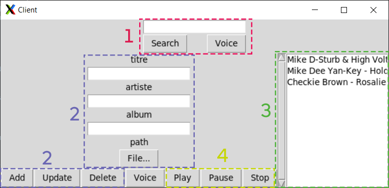
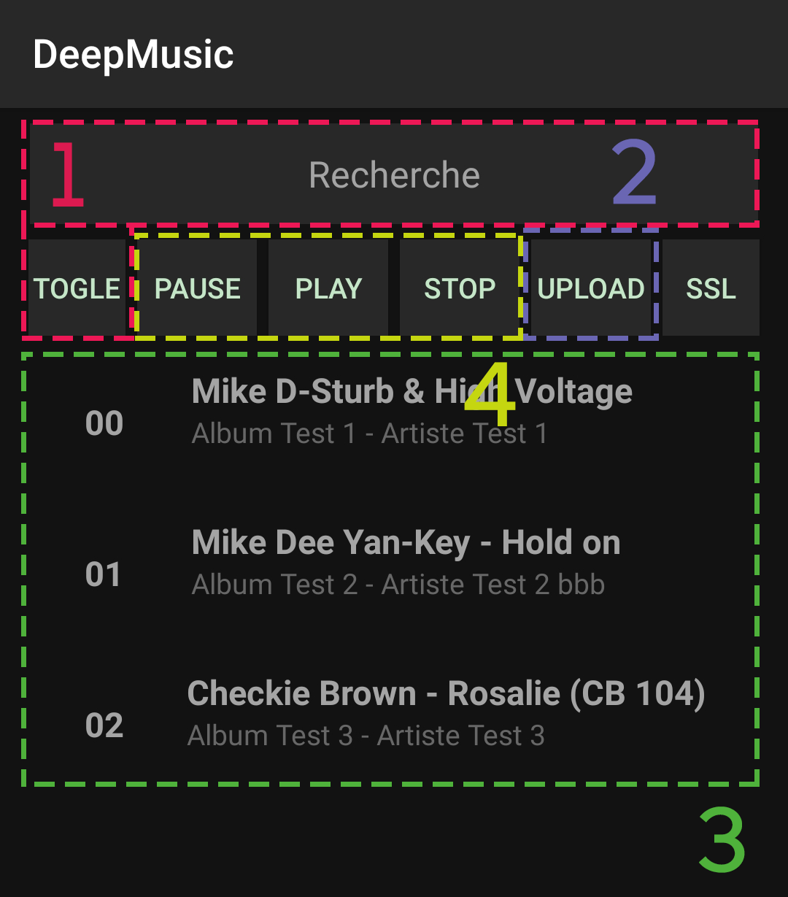

   

DeepMusic is an easy to use Spotify like app to manage and listen to your favorites musics.

Technically, this project is an Android Client and its entire RPC / MOM backend. After being recorded, the input sequence is transcribed by the Android SpeechToText API provided natively on Android. Then, the transcription is provided to an homemade named entity recognition system which is done with Flair to identify semantic entities such like: Artist(s), Music Name, Order, ... In response of that, the correct order is emitted and the music stream is played, stopped or paused on the device. The solution is scalable to dozen of mobile devices and multiple backend servers thanks to IceGrid. 

Administration             |  Android Client
:-------------------------:|:-------------------------:
  |  

<!--  -->
## Install Dependencies
* `sudo apt-get install vlc`
* `pip install -r requirements.txt`

## Another Dependency for Compiling Android on Windows
* Install the Zeroc Ice 3.7 for Java [here](https://zeroc.com/downloads/ice/3.7/java)

## Server Installation
Here is the procedure to install this software :
1. Run MySQL Server
   1. Linux: `sudo systemctl start mysql`
   2. Windows: Start [XAMPP](https://www.apachefriends.org/fr/index.html)
2. Run: `icegridnode --Ice.Config=config.grid`

## Client Installation
Here is the procedure to install this software :
1. Android
   1. Download the **.APK** in the release section
   2. Install it on your Android device
   3. Run it when the server is started
2. Python, Run it using
   1. `icegridadmin --Ice.Config=config.grid -e "application add application.xml"`
   2. `python client.py`

## References
* [Dribble](https://dribbble.com/)
* [Behance](https://www.behance.net/)
* [Illustrations](https://undraw.co/illustrations)
* [Some Icons](http://flaticon.com/)
* https://www.w3schools.com/python/python_mysql_delete.asp
* https://search.maven.org/search?q=g:com.zeroc%20AND%20v:3.7.5
