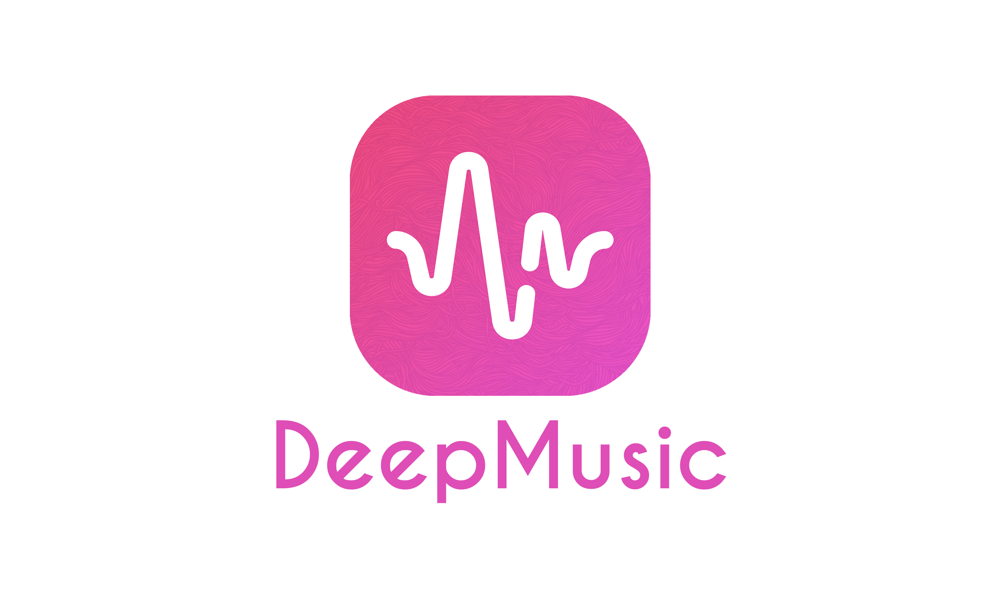

   

DeepMusic is an easy to use Spotify like app to manage and listen to your favorites musics.

Technically, this is an Android Application and its entire RPC / MOM backend.

<!--  -->
## Install Dependencies
* `sudo apt-get install vlc`
* `pip install -r requirements.txt`

## Another Dependency for Compiling Android on Windows
* Install the Zeroc Ice 3.7 for Java [here](https://zeroc.com/downloads/ice/3.7/java)

## Client Installation
Here is the procedure to install this software :
1. Download the *.APK* in the release section
2. Install it on your Android device
3. Run it

## Server Installation
Here is the procedure to install this software :
1. Start Audio: `pulseaudio --start`
2. Run: `./server.py`

## References
* [Dribble](https://dribbble.com/)
* [Behance](https://www.behance.net/)
* [Illustrations](https://undraw.co/illustrations)
* [Some Icons](http://flaticon.com/)